# FlashyCard — Developer Guide

---

## Table of Contents

1. [Acknowledgements](#acknowledgements)
2. [Design and Implementation](#design-and-implementation)
   - [Architecture Overview](#architecture-overview)
   - [UI Component](#ui-component)
   - [Parser Component](#parser-component)
   - [Command Component](#command-component)
   - [Model Component](#model-component)
   - [Storage Component](#storage-component)
   - [SessionContainer](#sessioncontainer)
3. [Implementation: Feature Deep-Dives](#implementation-feature-deep-dives)
   - [Add a Card (`add`)](#add-a-card)
   - [Delete a Card (`delete`)](#delete-a-card)
   - [Edit a Card (`edit`)](#edit-a-card)
   - [View a Card (`view`)](#view-a-card)
   - [Flip a Card (`flip`)](#flip-a-card)
   - [Find Cards (`find`)](#find-cards)
   - [List Cards (`list`)](#list-cards)
   - [Save to Test Set (`save`)](#save-to-test-set)
   - [Remove from Test Set (`remove`)](#remove-from-test-set)
   - [Test a Set (`test`)](#test-a-set)
   - [Tag a Card (`tag`)](#tag-a-card)
   - [List All Tags (`tags`)](#list-all-tags)
   - [Exit (`exit`)](#exit)
   - [Storage: Save Operation](#storage-save-operation)
   - [Storage: Load Operation](#storage-load-operation)
4. [Product Scope](#product-scope)
5. [User Stories](#user-stories)
6. [Non-Functional Requirements](#non-functional-requirements)
7. [Glossary](#glossary)
8. [Instructions for Manual Testing](#instructions-for-manual-testing)

---

## Acknowledgements

This project is built from scratch without reusing code from other projects.  
The command-parser architecture was inspired by [AddressBook Level-3 (AB3)](https://github.com/se-edu/addressbook-level3).

The following tools and libraries were used during development:

- [PlantUML](https://plantuml.com/) — for UML diagram generation.
- The NUS CS2113 teaching team for instructional guidance.

---

## Design and Implementation

### Architecture Overview

FlashyCard follows a layered architecture with clear separation of concerns. The core architecture follows a design pattern for Command Line Interface applications.

The execution flows through several distinct components and objects that handle user interaction, parsing, execution, data management, and persistence respectively. The diagram below shows all major components and how they interact.

**Architecture Component Diagram:**


**Component Relationships:**

- **`FlashyCard`** is the entry point. It wires all components together and runs the main input loop.
- **`Ui`** handles all terminal input and output (reading commands, printing messages).
- **`Parser` / `CommandParser`** transforms raw user input strings into executable `Command` objects.
- **`Command`** (abstract base + concrete subclasses) encapsulates executable logic for each user action.
- **`KnowledgeBase`** is the in-memory model holding all `Card` objects and test sets in `HashMap` structures.
- **`Storage`** persists and loads `KnowledgeBase` data to and from disk.
- **`SessionContainer`** holds transient per-session state such as the last search results and the active study session.

**Key Design Principles:**

- **Single Responsibility:** Each component owns exactly one concern. `Ui` never mutates data; `KnowledgeBase` never does I/O.
- **Command Pattern:** All user actions are encapsulated as `Command` objects. `FlashyCard` only calls `c.execute(...)` and never inspects the type of command.
- **Immutable Model Objects:** `Card` is intentionally immutable. Mutations (edit, tag) delete the old card and add a new one.
- **Layered Architecture:** `UI → Logic (Command) → Model (KnowledgeBase) → Storage`.

---

### UI Component

The `Ui` component is responsible for reading user input from `System.in` and displaying all output to `System.out`. It does not contain any business logic.

#### Class Diagram

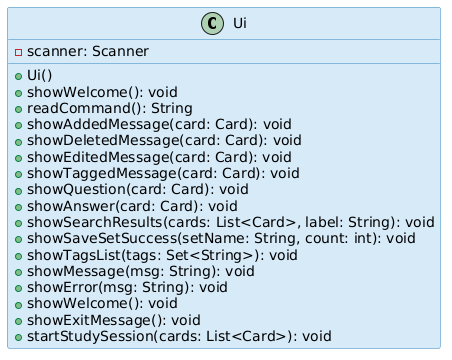

#### How the UI Component Works

The `Ui` class wraps a `java.util.Scanner` that reads from `System.in`. The `FlashyCard.run()` loop calls `ui.readCommand()` to block and wait for each line of input. After a `Command` executes, individual `show*` methods are called to display results.

The `startStudySession()` method is a special interactive loop that drives the `test` command — it walks the user card-by-card through a `List<Card>`.

#### Sequence Diagram: Main Application Loop

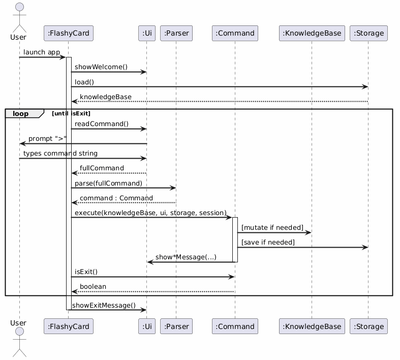

---

### Parser Component

**API:** `Parser.java`, `CommandParser.java`, and all `XxxCommandParser.java` classes.

The `Parser` component transforms a raw user input string into a concrete `Command` object ready for execution.

#### Architecture

`Parser` holds a static array of `CommandParser` instances, one per supported command. Each `CommandParser` subclass defines:

1. A **command prefix** (e.g., `"add"`, `"edit"`) stored in `MATCH_PREFIX`.
2. A **compiled regex pattern** (`ARGS_REGEX`) built from the prefix and an argument pattern.

`Parser.parse()` extracts the first word of the input, iterates through all parsers until one matches the prefix, then delegates to `CommandParser.parse()` which applies the full regex and extracts named groups.

#### Class Diagram

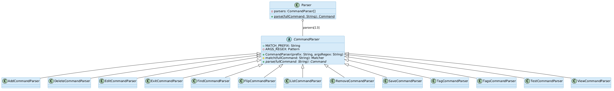

#### Sequence Diagram: Parsing a Command

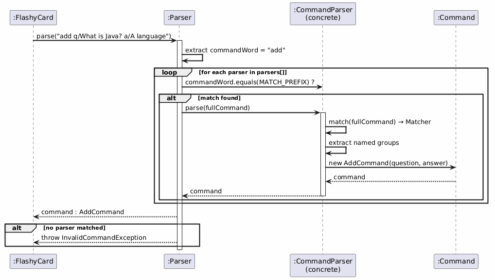

---

### Command Component

**API:** `Command.java` and all `XxxCommand.java` classes.

All commands extend the abstract `Command` class and override:

```java
public void execute(KnowledgeBase cards, Ui ui, Storage storage, SessionContainer session)
```

The `isExit()` method defaults to `false` and is overridden only by `ExitCommand`.

#### Command Class Hierarchy Diagram

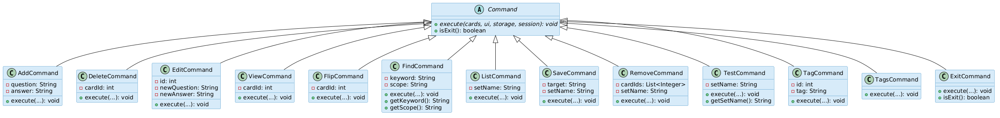

---

### Model Component

**API:** `Card.java`, `KnowledgeBase.java`, `StudySession.java`

The Model component stores all application data in memory.

#### Class Diagram

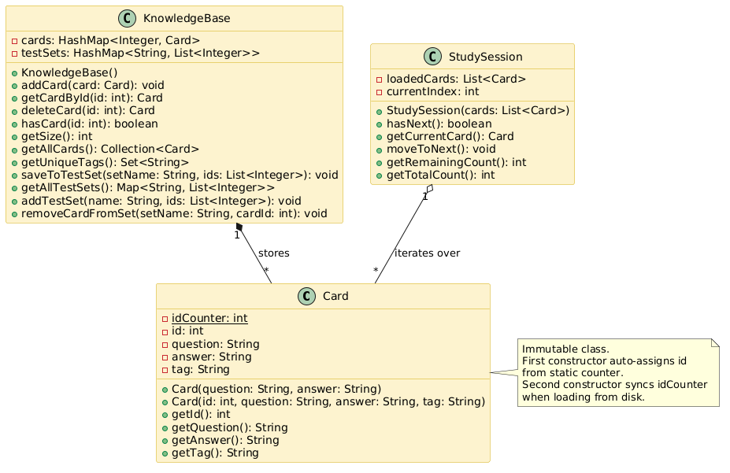

#### Design Notes

- **`Card` is immutable.** All fields are `final`. To "edit" a card, the old one is deleted from `KnowledgeBase` and a new one is added in its place (preserving the same `id`).
- **`KnowledgeBase` uses two `HashMap`s.** `cards` maps `Integer id → Card` for O(1) lookup. `testSets` maps `String setName → List<Integer>` for O(1) set retrieval.
- **`StudySession` is stateful.** It wraps a defensive copy of the card list and tracks a `currentIndex` pointer that advances as the user steps through cards.

---

### Storage Component

**API:** `Storage.java`

The `Storage` component is responsible for persisting all `Card` objects and test sets to disk, and reloading them on application startup.

#### Class Diagram

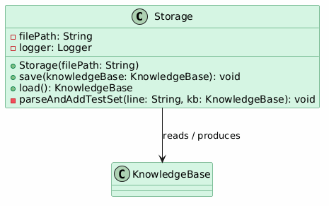

#### File Format

Each `Card` is serialized as one line:

```
id|question|answer|tag
```

Test sets are serialized as:

```
SET:setName|id1,id2,id3
```

The pipe character `|` inside any field value is escaped as `\|` to prevent incorrect splitting.

**Example data file (`data/flashcards.txt`):**

```
1|What is Java?|A programming language|none
2|What is OOP?|Object Oriented Programming|science
3|What is 2+2?|4|none
SET:mySet|1,2
```

---

### SessionContainer

**API:** `SessionContainer.java`

`SessionContainer` holds **transient** state that lives for one application run only — it is never persisted to disk.

#### Class Diagram

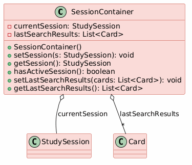

`lastSearchResults` is populated by **`ListCommand`** and **`TestCommand`** only. `FindCommand` does **not** populate `lastSearchResults` — it only displays matching cards without storing them in the session. `SaveCommand` consumes `lastSearchResults` when the user types `save all s/mySet`.

---

## Implementation: Feature Deep-Dives

This section explains each command in detail, including step-by-step walkthrough and sequence diagrams.

---

### Add a Card

**Command syntax:** `add q/QUESTION a/ANSWER`

**Parsed by:** `AddCommandParser` using regex `q/(?<question>.+?)\ba/(?<answer>.+)`

**Executed by:** `AddCommand`

#### Step-by-Step

1. User types `add q/What is Java? a/A programming language`.
2. `Parser.parse()` extracts the command word `"add"` and delegates to `AddCommandParser`.
3. `AddCommandParser` applies the regex, extracts named groups `question` and `answer`, and returns `new AddCommand(question, answer)`.
4. `FlashyCard.run()` calls `c.execute(knowledgeBase, ui, storage, session)`.
5. `AddCommand.execute()` creates a new `Card(question, answer)` — the `Card` constructor auto-assigns the next available `id` from the static counter.
6. The card is added to `KnowledgeBase` via `cards.addCard(card)`.
7. `storage.save(knowledgeBase)` writes the updated state to disk.
8. `ui.showAddedMessage(card)` prints a confirmation to the terminal.

#### Sequence Diagram

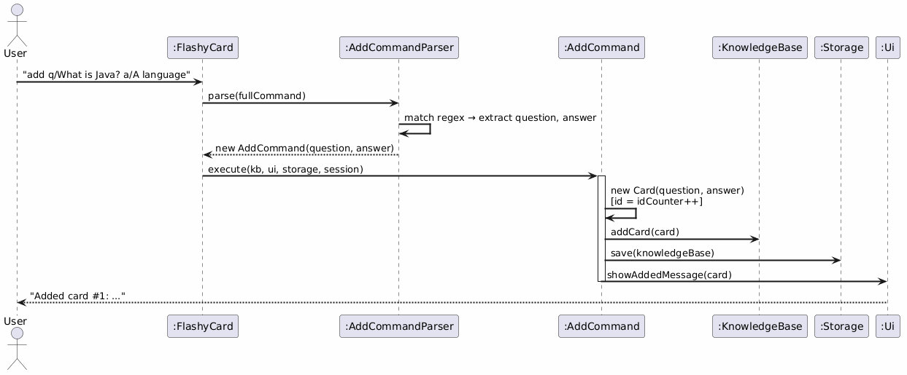

#### Design Note

`AddCommand` does **not** check for duplicate content — FlashyCard allows multiple cards with the same question. The only uniqueness constraint is the numeric `id`, which is guaranteed by the auto-incrementing static counter in `Card`.

---

### Delete a Card

**Command syntax:** `delete ID`

**Parsed by:** `DeleteCommandParser`

**Executed by:** `DeleteCommand`

#### Step-by-Step

1. User types `delete 2`.
2. `DeleteCommandParser` parses the `id` field and creates `new DeleteCommand(2)`.
3. `DeleteCommand.execute()` calls `cards.deleteCard(cardId)`.
4. `KnowledgeBase.deleteCard()` checks that the card exists; if not, throws `CardNotFoundException` which propagates to `FlashyCard.run()` and is shown as an error.
5. If found, the card is removed from the `HashMap` and returned.
6. `storage.save(knowledgeBase)` is called to immediately persist the deletion to disk.
7. `ui.showDeletedMessage(deletedCard)` prints the confirmation.

#### Sequence Diagram

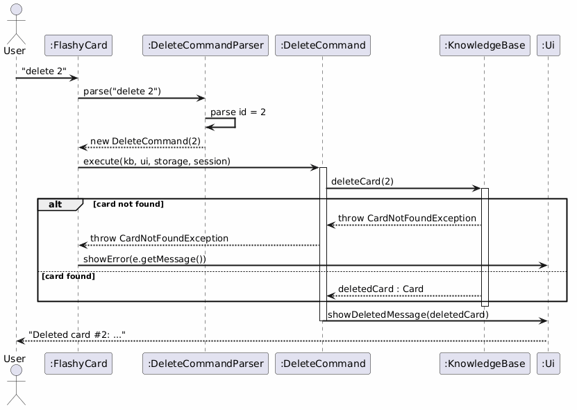

---

### Edit a Card

**Command syntax:** `edit ID [q/NEW_QUESTION] [a/NEW_ANSWER]`

**Parsed by:** `EditCommandParser` using regex `(?<id>\d+)(?:\s+q/(?<question>.+?)(?=\s+a/|$))?(?:\s+a/(?<answer>.+))?`

**Executed by:** `EditCommand`

At least one of `q/` or `a/` must be present; omitted fields are preserved from the existing card.

#### Step-by-Step

1. User types `edit 1 q/What is Go? a/A compiled language`.
2. `EditCommandParser` extracts `id=1`, `question="What is Go?"`, `answer="A compiled language"`.
3. `EditCommand.execute()`:
   - Calls `cards.getCardById(1)` to retrieve the existing card.
   - Merges: if `newQuestion != null` use it, else keep `old.getQuestion()`. Same for answer. Tag is **always** preserved.
   - Creates a new immutable `Card(old.getId(), updatedQuestion, updatedAnswer, old.getTag())`.
   - Deletes the old card, adds the new card.
4. Calls `storage.save()` and `ui.showEditedMessage(edited)`.

#### Sequence Diagram

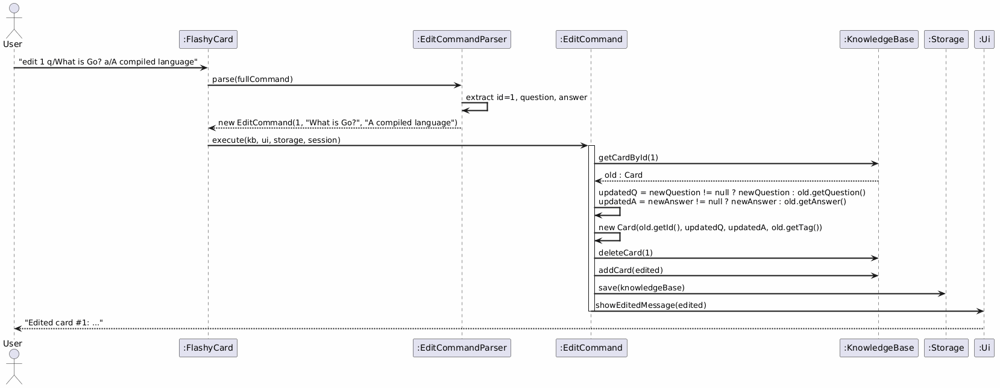

#### Design Note — Immutability via Delete-and-Recreate

Because `Card` is immutable, editing requires deleting the old object and inserting a new one with the same `id`. This pattern ensures that there is never a partially-mutated card in memory. The same pattern is used by `TagCommand`.

---

### View a Card

**Command syntax:** `view ID`

**Parsed by:** `ViewCommandParser`

**Executed by:** `ViewCommand`

#### Step-by-Step

1. User types `view 1`.
2. `ViewCommand.execute()` calls `cards.getCardById(1)`.
3. Calls `ui.showQuestion(selectedCard)` — only the question is shown, not the answer. This simulates the "front" of a flashcard.

#### Sequence Diagram

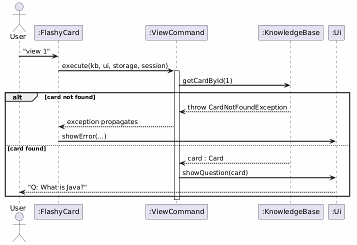

---

### Flip a Card

**Command syntax:** `flip ID`

**Parsed by:** `FlipCommandParser`

**Executed by:** `FlipCommand`

Identical flow to `view`, but calls `ui.showAnswer(selectedCard)` to reveal the answer — simulating the "back" of a flashcard.

#### Sequence Diagram

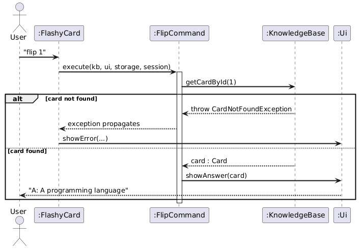

---

### Find Cards

**Command syntax:** `find [q/|a/]KEYWORD`

**Parsed by:** `FindCommandParser` using regex `(?:(?<scope>[qa])/)?(?<keyword>.+)`

**Executed by:** `FindCommand`

The optional `q/` or `a/` prefix restricts the search to questions or answers respectively. Without a prefix, both are searched.

#### Step-by-Step

1. User types `find q/Java`.
2. `FindCommandParser` extracts `scope="q"`, `keyword="java"` (lowercased in `FindCommand`).
3. `FindCommand.execute()` streams all cards from `hb.getAllCards()`.
4. Each card is filtered: if `scope == "q"`, only `card.getQuestion().toLowerCase().contains(keyword)` is checked.
5. Matching cards are collected into a `List<Card>` and passed to `ui.showSearchResults(results, keyword)`.
6. **`FindCommand` does NOT call `session.setLastSearchResults()`** — results are displayed only. Only `ListCommand` and `TestCommand` populate `SessionContainer`. Users who want to `save all` must run `list` first.

#### Sequence Diagram

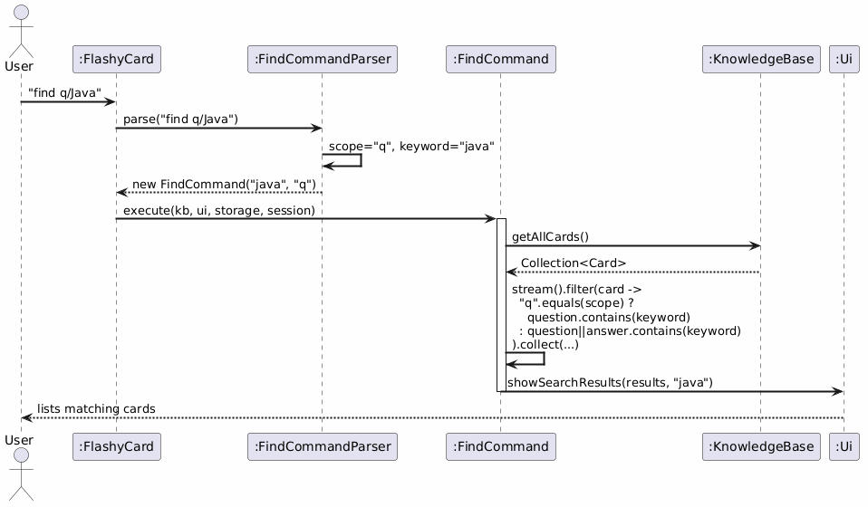

---

### List Cards

**Command syntax:** `list` or `list s/SET_NAME`

**Parsed by:** `ListCommandParser`

**Executed by:** `ListCommand`

#### Step-by-Step

1. User types `list` (no set name).
2. `ListCommand.execute()`:
   - `setName == null`: adds all cards from `hb.getAllCards()` to `cardsToShow`.
   - `setName != null`: looks up `hb.getAllTestSets().get(setName)`, retrieves each card by id.
3. `session.setLastSearchResults(cardsToShow)` — stores results so `save all` can use them.
4. `ui.showSearchResults(cardsToShow, label)` prints the list.

#### Sequence Diagram

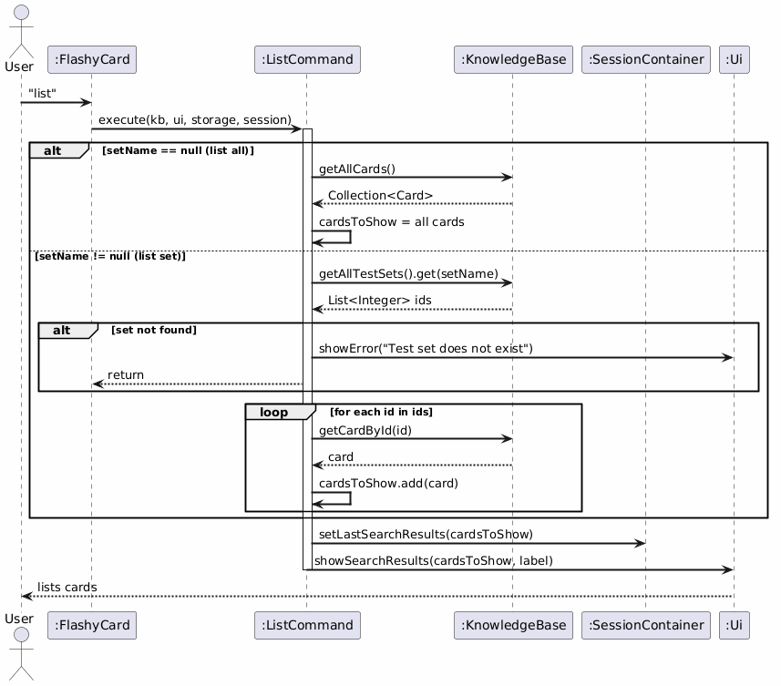

---

### Save to Test Set

**Command syntax:** `save all s/SET_NAME` or `save ID s/SET_NAME`

**Parsed by:** `SaveCommandParser`

**Executed by:** `SaveCommand`

#### Step-by-Step

1. User types `save all s/revision` after a `list`.
2. `SaveCommand.execute()`:
   - If `target == "all"`: retrieves `session.getLastSearchResults()`. If empty, shows error. Note: only `list` and `test` populate this — `find` does not.
   - If `target` is a number: checks `hb.hasCard(id)`.
3. Calls `hb.saveToTestSet(setName, idsToSave)` — this appends to the set, skipping duplicates.
4. Calls `storage.save(hb)` and `ui.showSaveSetSuccess(setName, count)`.

#### Sequence Diagram

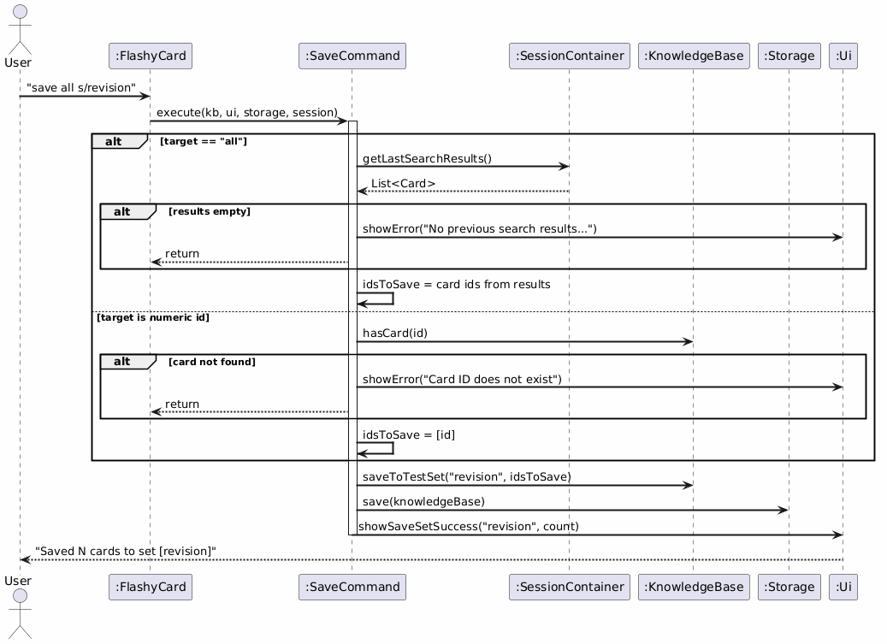

---

### Remove from Test Set

**Command syntax:** `remove ID... s/SET_NAME` or `remove all s/SET_NAME`

**Parsed by:** `RemoveCommandParser`

**Executed by:** `RemoveCommand`

#### Step-by-Step

1. User types `remove 1 2 s/revision`.
2. `RemoveCommandParser` splits `target = "1 2"` into `[1, 2]`, creates `new RemoveCommand([1, 2], "revision")`.
3. `RemoveCommand.execute()`:
   - Checks set exists in `hb.getAllTestSets()`.
   - If `cardIds == null` (remove all): replaces the set with an empty `ArrayList`.
   - Otherwise: calls `hb.removeCardFromSet(setName, id)` for each id.
4. Calls `storage.save(hb)` after any successful removal.

#### Sequence Diagram

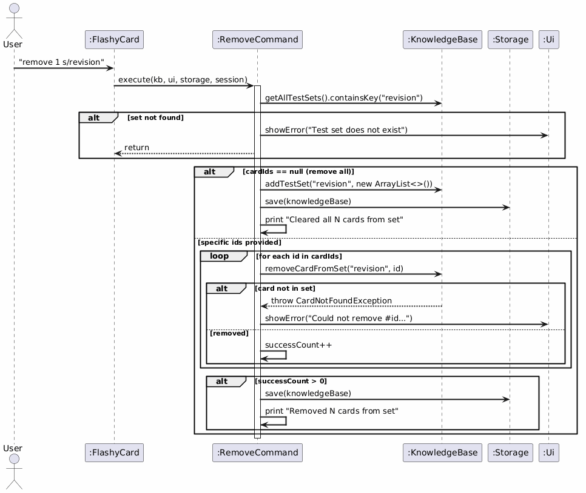

---

### Test a Set

**Command syntax:** `test SET_NAME`

**Parsed by:** `TestCommandParser`

**Executed by:** `TestCommand`

`TestCommand` starts an interactive study session driven entirely by `Ui.startStudySession()`.

#### Step-by-Step

1. User types `test revision`.
2. `TestCommand.execute()`:
   - Retrieves the id list from `hb.getAllTestSets().get(setName)`.
   - Validates the set exists and is not empty.
   - Collects the `Card` objects into `testCards`.
   - Stores cards in `session.setLastSearchResults(testCards)` — this allows a subsequent `save all` to capture the test set's cards into another set.
   - Calls `ui.startStudySession(testCards)` which runs the interactive quiz loop.

#### Sequence Diagram

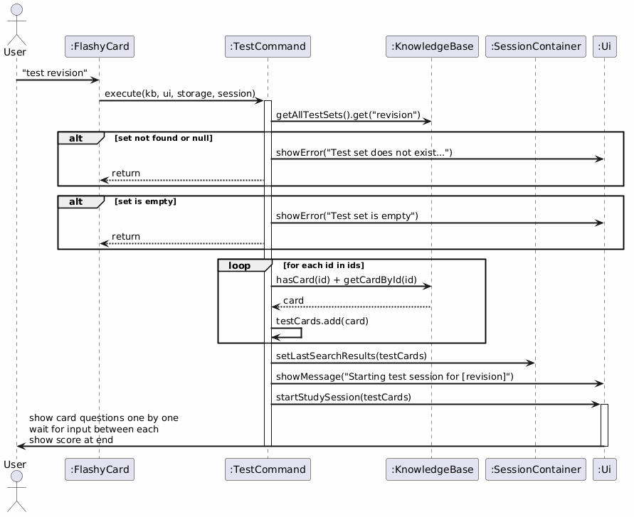

---

### Tag a Card

**Command syntax:** `tag ID t/TAG`

**Parsed by:** `TagCommandParser`

**Executed by:** `TagCommand`

#### Step-by-Step

1. User types `tag 1 t/programming`.
2. `TagCommand.execute()`:
   - Retrieves the old card via `cards.getCardById(id)`.
   - Creates a new `Card(oldCard.getId(), oldCard.getQuestion(), oldCard.getAnswer(), tag)`.
   - Deletes old, adds new (same delete-and-recreate pattern as `EditCommand`).
   - Saves and shows confirmation.

#### Sequence Diagram

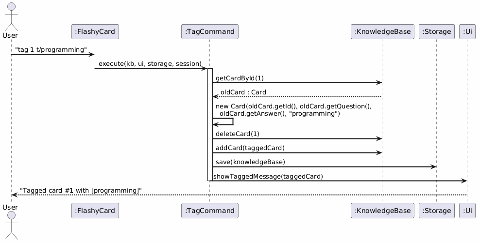

---

### List All Tags

**Command syntax:** `tags`

**Parsed by:** `TagsCommandParser`

**Executed by:** `TagsCommand`

`TagsCommand` calls `hb.getUniqueTags()` which streams all cards, maps each to its `tag` field, and collects into a `TreeSet` (alphabetically sorted, no duplicates). The set is passed to `ui.showTagsList(tags)`.

#### Sequence Diagram

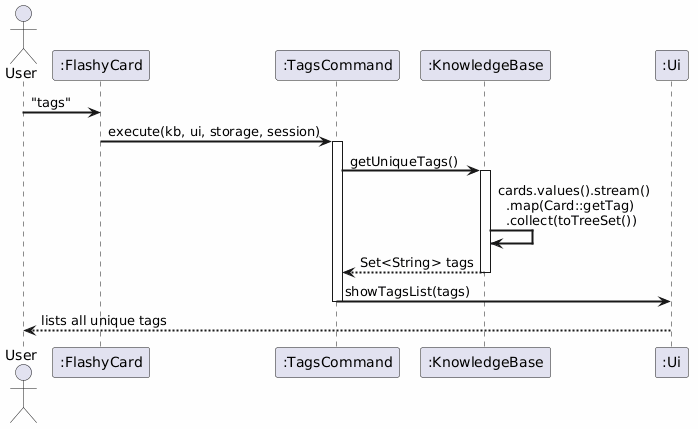

---

### Exit

**Command syntax:** `exit`

**Parsed by:** `ExitCommandParser`

**Executed by:** `ExitCommand`

`ExitCommand.execute()` does nothing. Its `isExit()` returns `true`, which causes the `FlashyCard.run()` loop to terminate. `ui.showExitMessage()` is called after the loop ends.

#### Sequence Diagram

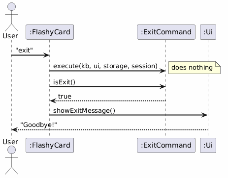

---

### Storage: Save Operation

#### Step-by-Step

1. `storage.save(knowledgeBase)` is called.
2. A `BufferedWriter` is opened on the file path (overwriting the file entirely).
3. For each `Card` in `knowledgeBase.getAllCards()`:
   - `|` characters in `question`, `answer`, and `tag` are escaped to `\|`.
   - Writes line: `id|question|answer|tag`.
4. For each test set entry in `knowledgeBase.getAllTestSets()`:
   - Set name `|` chars are escaped.
   - Card IDs are joined by `,`.
   - Writes line: `SET:setName|id1,id2,...`.
5. Writer is closed.

#### Sequence Diagram

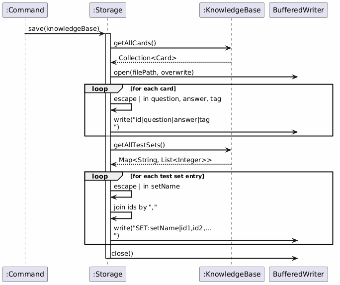

---

### Storage: Load Operation

#### Step-by-Step

1. `storage.load()` is called at startup.
2. A `BufferedReader` reads the file line by line.
3. Blank lines are skipped.
4. Lines starting with `SET:` are parsed by `parseAndAddTestSet()`:
   - Strips `SET:` prefix, splits on unescaped `|`, reads set name and comma-separated IDs.
5. Other lines are split on unescaped `|` into 3–4 parts.
   - Part 0 → `id` (must parse as integer, else `CorruptedDataException`).
   - Part 1 → `question` (unescape `\|`).
   - Part 2 → `answer` (unescape `\|`).
   - Part 3 → `tag` (or `"none"` if absent).
6. A `Card(id, question, answer, tag)` is created — this also syncs `idCounter` so new cards get higher ids.
7. Card is added to the `KnowledgeBase`.
8. Populated `KnowledgeBase` is returned.

#### Sequence Diagram

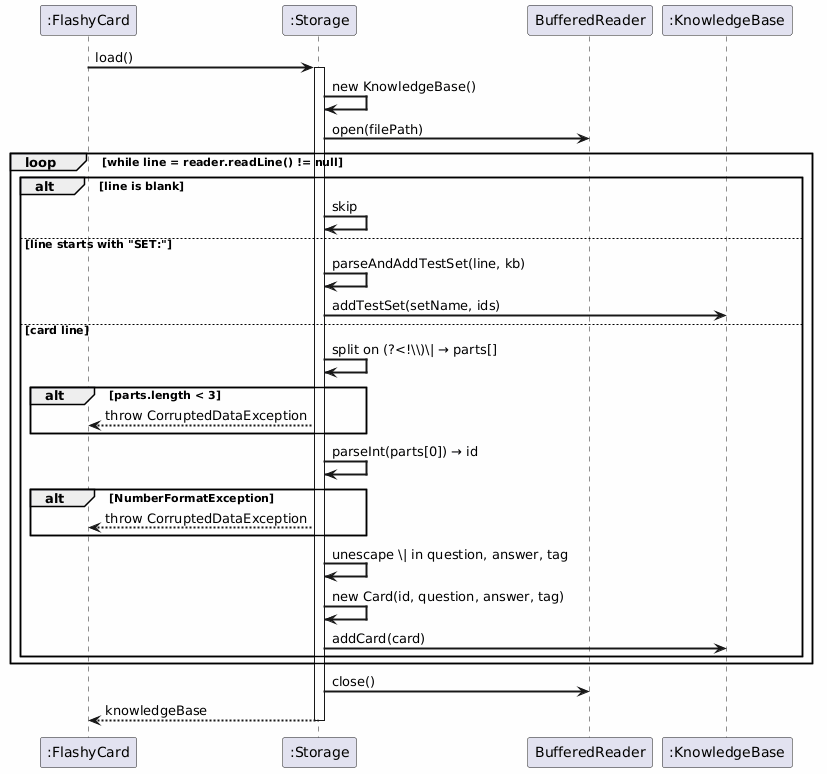

---

## Product Scope

### Target User Profile

- University or secondary school students who need to memorise large amounts of content.
- Users who prefer or are comfortable with CLI tools.
- Fast typists who find GUI applications slower for repetitive data entry.

### Value Proposition

FlashyCard lets students create, organise, and self-test with flashcards entirely from the terminal — faster than GUI apps for users who type quickly. Test sets allow targeted revision of specific topics without manually filtering cards each time.

---

## User Stories

| Version | As a …   | I want to …                              | So that I can …                             |
|---------|----------|------------------------------------------|---------------------------------------------|
| v1.0    | new user | add flashcards with a question/answer    | build my knowledge base                     |
| v1.0    | user     | list all my flashcards                   | see what I have stored                      |
| v1.0    | user     | view a card's question                   | test my recall before flipping              |
| v1.0    | user     | flip a card to see the answer            | verify whether I recalled correctly         |
| v1.0    | user     | delete a card                            | remove outdated or incorrect cards          |
| v2.0    | user     | edit an existing card                    | fix mistakes without deleting and re-adding |
| v2.0    | user     | tag cards with a category                | organise cards by topic                     |
| v2.0    | user     | find cards by keyword                    | locate specific cards quickly               |
| v2.0    | user     | find cards only in questions or answers  | perform scoped search efficiently           |
| v2.0    | user     | see all unique tags in my knowledge base | understand what categories I have           |
| v2.0    | user     | save search results to a test set        | create targeted revision sets               |
| v2.0    | user     | save a specific single card to a set     | build sets card by card                     |
| v2.0    | user     | run a test session on a set              | quiz myself on a specific topic             |
| v2.0    | user     | remove a card from a test set            | keep sets relevant                          |
| v2.0    | user     | clear all cards from a test set          | reset a revision set quickly                |
| v2.0    | user     | list cards in a specific test set        | review what a set contains                  |

---

## Non-Functional Requirements

1. **Portability:** Should work on Windows, macOS, and Linux with Java 17 installed.
2. **Performance:** All commands should respond within 1 second for a knowledge base of up to 10,000 cards.
3. **Persistence:** Data must persist across sessions without requiring manual saving by the user.
4. **Human-Readability:** The data file (`data/flashcards.txt`) should be human-readable for manual inspection or backup.
5. **Robustness:** The application must not crash on invalid user input; all errors must display descriptive messages.
6. **Correctness:** Corrupted storage files must not silently produce wrong data — `CorruptedDataException` must be thrown and handled gracefully, starting with an empty knowledge base.

---

## Glossary

| Term | Definition |
|------|-----------|
| **Card** | A flashcard consisting of an auto-assigned integer ID, a question string, an answer string, and a tag string. |
| **KnowledgeBase** | The in-memory store of all cards and test sets for one application run. |
| **Test Set** | A named collection of card IDs used for focused study sessions. |
| **Tag** | A category label assigned to a card. Default value is `"none"`. |
| **SessionContainer** | Holds transient per-session state (last list/test results, active study session) that is not persisted to disk. |
| **StudySession** | A stateful iterator over a list of cards used during a `test` command session. |
| **CommandParser** | An abstract class whose concrete subclasses each know how to parse one command type. |
| **Command** | An abstract class whose concrete subclasses each know how to execute one command type. |
| **idCounter** | A static field in `Card` that auto-increments to assign unique IDs. It is synced upward whenever cards are loaded from disk. |
| **Escaped pipe** | The sequence `\|` used in the storage file to represent a literal `|` character within a field value. |
| **CorruptedDataException** | A checked exception thrown by `Storage.load()` when the file format is invalid. |

---

## Instructions for Manual Testing

### Prerequisites

Ensure Java 17 is installed. Compile and build the project with your preferred tool (e.g., Gradle or Maven), then run:

```
java -jar flashycard.jar
```

Or run `FlashyCard.main()` directly from your IDE.

---

### Loading Sample Data

To test with pre-existing data, create `data/flashcards.txt` in the same folder as the JAR with this content:

```
1|What is Java?|A programming language|none
2|What is OOP?|Object Oriented Programming|science
3|What is 2+2?|4|none
SET:mySet|1,2
```

Then launch the app — it will load 3 cards and 1 test set automatically.

---

### Test Case 1: Adding a Card

**Input:** `add q/What is Python? a/A scripting language`

**Expected:** Confirmation message showing the new card's assigned ID (e.g., `#4` if 3 cards were pre-loaded).

---

### Test Case 2: Adding a Card with Missing Fields

**Input:** `add q/Only a question`

**Expected:** `ERROR: Invalid argument format given for add command`

---

### Test Case 3: Listing All Cards

**Input:** `list`

**Expected:** All cards shown with their IDs, questions, and tags.

---

### Test Case 4: Viewing and Flipping

**Input:** `view 1` then `flip 1`

**Expected:** First command shows only the question. Second shows only the answer.

---

### Test Case 5: Viewing a Non-Existent Card

**Input:** `view 999`

**Expected:** `ERROR: Card with given ID cannot be found in the knowledge base`

---

### Test Case 6: Editing a Card

**Input:**
```
edit 1 q/What is Go? a/A compiled language
edit 2 q/What is Abstraction?
edit 3 a/Four
```

**Expected:** Only the specified fields change. Tag is always preserved.

---

### Test Case 7: Editing with No Fields

**Input:** `edit 1`

**Expected:** `ERROR: Edit command requires at least q/QUESTION or a/ANSWER.`

---

### Test Case 8: Tagging

**Input:** `tag 1 t/programming` then `tags`

**Expected:** Card 1 now has tag `programming`. The `tags` command lists all unique tags.

---

### Test Case 9: Finding Cards

**Input:**
```
find java
find q/What
find a/Four
```

**Expected:** Results displayed in each case. Note: `find` results cannot be used with `save all` — run `list` first for that.

---

### Test Case 10: Save All Requires Prior List

**Input:**
```
find java
save all s/findtest
```

**Expected:** `ERROR: No previous search results found to save. Try 'find' or 'list' first.`
This confirms that `find` does not populate `SessionContainer`. Run `list` first.

---

### Test Case 11: Saving to a Test Set via List

**Input:**
```
list
save all s/revision
save 1 s/singles
```

**Expected:** After `list`, all cards are in `SessionContainer`. `save all` saves them to `revision`. `save 1` saves only card 1 to `singles`.

---

### Test Case 12: Listing a Test Set

**Input:** `list s/revision` then `list s/nonexistent`

**Expected:** First shows cards in `revision`. Second shows an error.

---

### Test Case 13: Testing a Set

**Input:** `test revision`

**Expected:** Interactive quiz starts. Cards shown one by one. Score printed at end.

---

### Test Case 14: Removing from a Set

**Input:**
```
remove 1 s/revision
remove all s/singles
list s/revision
```

**Expected:** Card 1 removed from `revision`. `singles` is empty. `list s/revision` shows remaining cards.

---

### Test Case 15: Deleting a Card

**Input:** `delete 2` then `list`

**Expected:** Card 2 no longer appears. Deletion is immediately persisted — if app is relaunched, card 2 is still gone.

---

### Test Case 16: Deleting a Non-Existent Card

**Input:** `delete 999`

**Expected:** `ERROR: Cannot delete card: Card with given ID cannot be found in the knowledge base`

---

### Test Case 17: Persistence Check

1. Add cards and save a test set.
2. Type `exit`.
3. Relaunch the app.
4. Type `list` — all cards and sets should still be present.

---

### Test Case 18: Corrupted Data File

1. Open `data/flashcards.txt` in a text editor.
2. Delete part of a line so it has fewer than 3 pipe-separated fields.
3. Relaunch the app.

**Expected:** App prints a data-corruption warning and starts with an empty knowledge base. Does **not** crash.

---

### Test Case 19: Pipe Character in Card Content

**Input:**
```
add q/What does A|B mean? a/Bitwise OR operation
flip [id]
```

**Expected:** Card stored and retrieved correctly with the `|` character intact.

---